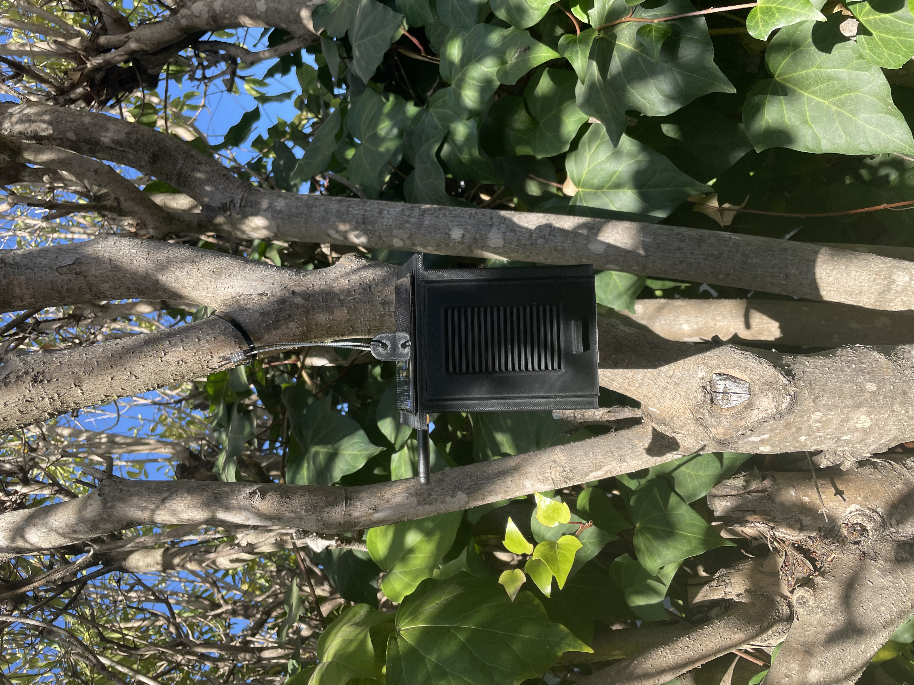
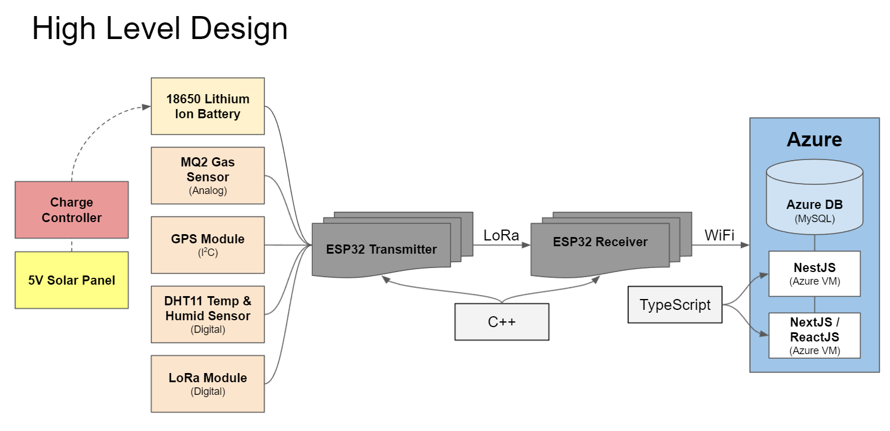
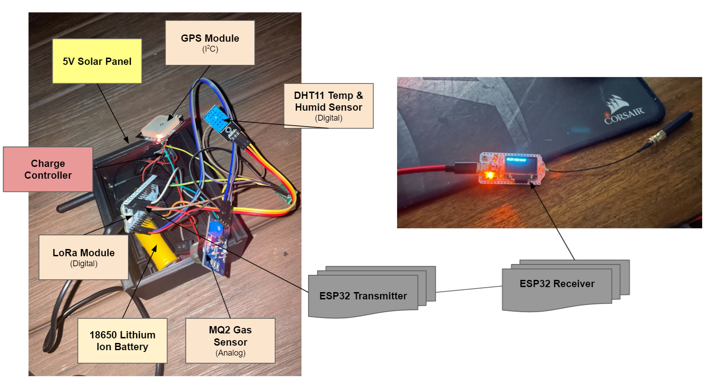
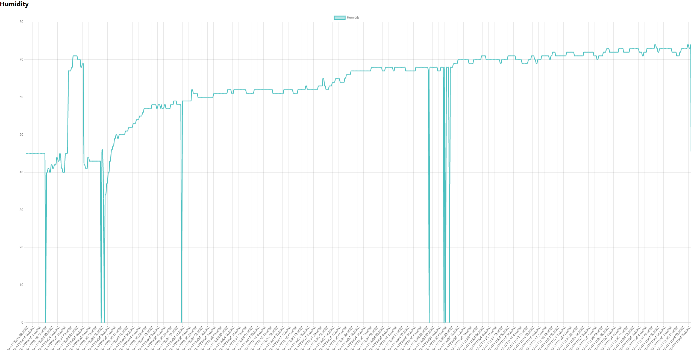
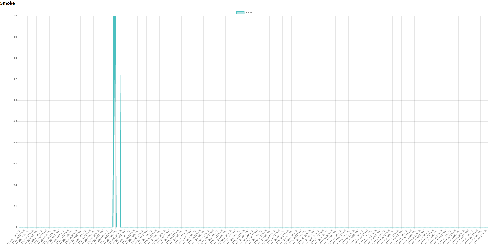
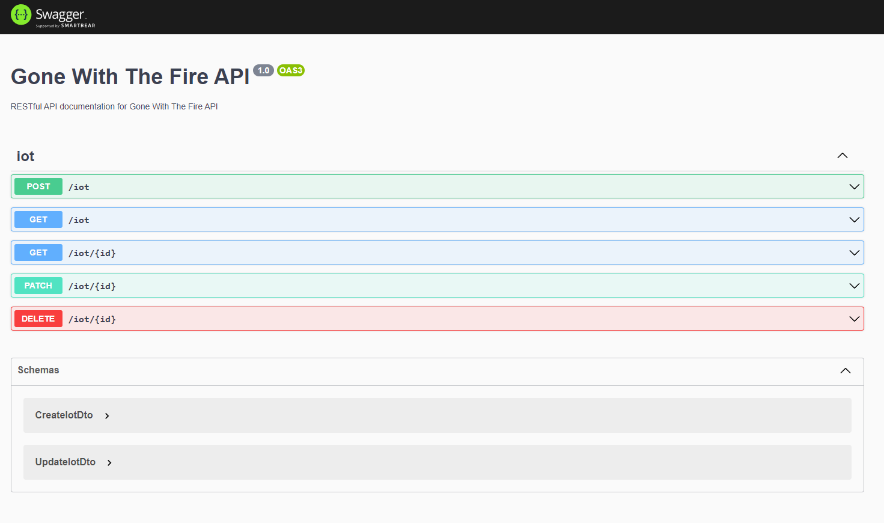

# Gone-with-the-Fire

### **_1st place winner of SCEhacks 2021 and winner of Best Use of Azure_**

A wildfire detection system that can detect wildfires up to 1 mile away using LoRa.

## Inspiration

We wanted to build something that utilized IoT since that is something we are passionate about. We thought of maybe using drones for wildfire detection but opted for this design due to its simplicity.

## What it does

A distributed LoRaWAN IoT network that is capable of detecting wildfires up to 1 mile away. Uploads the data to a Node.js backend where it gets saved to an Azure MySQL Database which then gets rendered on a ReactJS web application.

## How we built it

The nodes each contain solar panels, batteries, a smoke sensor, a temperature/humidity sensor, a GPS module, a LoRa module, and a Wi-Fi module that make our devices capable of detecting wildfires in very remote areas like in the middle of a forest. This data is shared amongst the nodes using LoRa in a distributed network fashion. The leader node will upload the shared data to our ExpressJS webserver where it will get saved to an Azure MySQL database. Our ReactJS website will grab that data and nicely display it using a graphing library.

### System Design

### Implementation

## Challenges we ran into

A lot of our challenges were on the cloud hosting side of things. Originally we wanted to build a CI/CD pipeline using Azure pipelines or GitHub Actions. These proved to be rather difficult and we ended up wasting a lot of time. In the end we opted towards using a virtual machine to deploy the applications. We also mistakenly setup an Azure database and ran with it for a day. This was a mistake as we ended up switching over to the Azure database for MySQL which we were more familiar with and it made our lives much easier.

## Accomplishments that we're proud of

We are pretty proud of our IoT system. This is the first time any of us have used LoRa and the first time we've ever implemented a distributed system. We are also proud of our project using Azure services. This was the first time any of us had ever touched Azure so it was fun learning it's ecosystem.

## What we learned

We learned that IoT systems are quite tricky to get right. We had multiple versions of the website and had to rewrite the IoT program a few times. We also learned that Azure defaults to it's Azure database which caught us off guard initially. We also learned that Azure has some really powerful CI/CD tools that with more time we probably could have set up properly.

## What's next for Gone With The Fire

Next we would like to refine the IoT system to be more power efficient. Currently it does not have any deep sleep mode so it is constantly running at full power.

## Built With

- C++
- TypeScript
- Node.js
- Platform IO
- ESP32 Heltec WiFi LoRa 32 V2
- TypeORM
- MySQL
- ReactJS
- NextJS
- Azure Database
- Azure VM

## Screenshots of Website

### Graph of Humidity

### Graph of Smoke (spike is when we lit paper towel on fire)

### RESTful backend documented using Swagger

### Additional Links

- [Plan of Reference (POR) Link](https://docs.google.com/presentation/d/13yUGjJ7CwL-o0hZ7u_5hC22aqC9KduTVEABmLtq134k/edit#slide=id.p)

- [DevPost Link](https://devpost.com/software/gone-with-the-fire)
